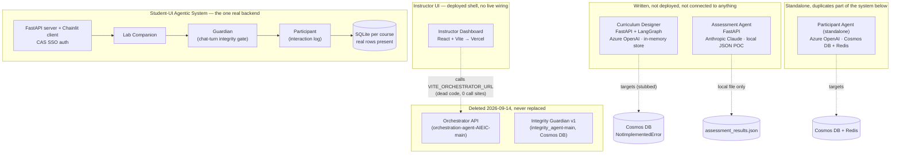
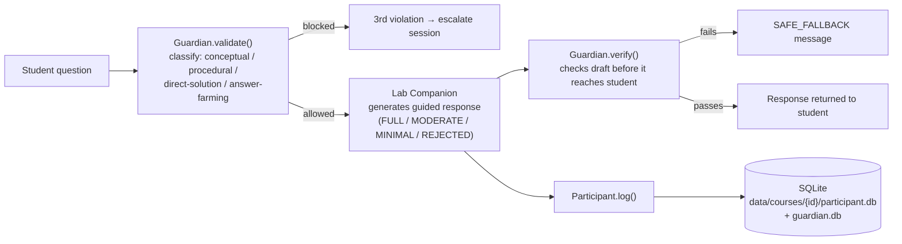

# AIEIC Implementation Audit

What's actually live, what's a local stub, and what got deleted last week — replacing the previous audit, which was out of date on most of these points.

**Repo:** CSUAIEI · **Branch audited:** `main` @ `b47d3ff` · **As of:** 2026-09-21

**Legend:** ● real data / verified · ◐ deployable, unconfirmed live · ◑ stub / POC · ○ deleted / dead code · ◈ duplicated

---

## System topology, as it exists today

The prior audit's central claim — "everything targets an Orchestrator and a Cosmos DB that don't exist" — no longer describes this repo. The Orchestrator was deleted. A second, unrelated backend was built and partly wired up with real persistence. Nothing was reconciled.

> **The single most important change since the last audit:** a new consolidated backend, `Student-UI_agentic_system-main/`, now does most of what the old audit described as five separate undeployed agents — and it's the only piece of the repo with verified real data (SQLite rows), named Azure infrastructure, and a real SSO flow. It has zero tests and isn't confirmed live, but it is unambiguously the most finished thing in the repo. Everything else — the Instructor UI, Curriculum Designer, Assessment Agent, and the standalone Participant Agent — is still disconnected from it and from each other.

---

## Instructor UI

**`Instructor-Dashboard-for-AIEIC-main`** — ◐ deploy config present · ○ zero live backend calls

| | |
|---|---|
| **Deployment** | `vercel.json` present (SPA rewrite only). No way to confirm from the repo whether it's actually live. |
| **Backend calls** | `src/api/agents.ts` is a real, typed client (`fetchDashboard`, `fetchActivityTab`, `fetchIntegrityAnalytics`, `triggerGradeBatch`) targeting `VITE_ORCHESTRATOR_URL` — but has **zero call sites** anywhere else in `src/`. It's orphaned, not aspirational: the Orchestrator it targets was built, matched its routes exactly, and was deleted a week before this audit. |
| **What renders** | All six tabs — including Material Preview, previously the one tab claimed to work — now render 100% hardcoded arrays. No tab fetches anything, so none of them can fail; they just show fixed fake data every time. |
| **Auth** | `LoginPage.tsx`'s submit handler calls `onLogin()` unconditionally — no credential check of any kind. |

Correction to prior audit: it was framed as "1 of 6 tabs works, 5 fail against a missing Orchestrator." The accurate framing is "0 of 6 tabs call anything; the Orchestrator they're built for existed and was deleted, not merely never built."

---

## Curriculum Designer

**`curriculum-designer-AIEIC-main`** — ◑ in-memory only · ○ not deployed

| | |
|---|---|
| **LLM** | `AzureLLMClient` wraps `langchain_openai.AzureChatOpenAI` (`services/llm.py`); a `MockLLMClient` exists for local dev. |
| **Persistence** | `MemoryStore` (plain in-process dict) is the only working backend. `build_store("cosmos")` raises `NotImplementedError` — the README's own words: "CosmosStore lands in v0.2 — set STORAGE_BACKEND=memory for now." |
| **Deployment** | `Dockerfile` present; README states target "Azure Container Apps" — a stated intent, not a confirmed live instance. |
| **Tests** | None. `tests/` holds only an empty `__init__.py`; the README's own architecture table lists tests as "Stage D (not yet implemented)." |

Unchanged from the prior audit's description — this is the one component where that audit still holds. It also references an `INTERFACE_CONTRACT.md` that no longer exists anywhere in the repo — it lived alongside the now-deleted Orchestrator.

---

## Assessment Agent

**`assessment-agent`** — ◑ local JSON POC · ○ not deployed

| | |
|---|---|
| **LLM** | Switched to **Anthropic Claude** — `ClaudeCLIProvider` (shells to a local `claude` CLI) or `AnthropicAPIProvider` (`ANTHROPIC_API_KEY`). No Azure/OpenAI dependency anywhere in this subtree anymore. |
| **Persistence** | Local JSON files behind a file lock (`persistence.py`). The interface modules say so directly in their own docstrings: *"POC: Persists to a local JSON file. In production, this would call the [agent]'s API."* |
| **Code grading** | Not being phased out — the opposite happened. `agents/code_grader.py` now calls the LLM for partial-credit scoring per test, replacing plain exact-match (commit `011ef4a`, "Finished making sub-agent that grades assignments LLM-based"). |
| **Deployment** | None — no Dockerfile, no compose file, no Procfile in this subtree. |
| **Tests** | **45 passed / 1 failed / 4 errored.** The 4 errors are a real, fixable bug: `conftest.py` computes the repo root two `.parent`s up, landing inside `assessment_agent/` instead of `assessment-agent/`, so it can't find the demo fixtures it needs. The 1 failure is an unrelated pre-existing string-match issue in a syntax-error test. |

---

## Student-UI Agentic System — new since the last audit

**`Student-UI_agentic_system-main`** — ● real SQLite data · ◐ named Azure infra, unconfirmed live · ○ no tests

This one codebase now covers what the prior audit described as three separate, undeployed, student-facing agents. It didn't exist as a single system before.

| | |
|---|---|
| **LLM** | Dual-provider by design behind one `LLMClient` protocol — `AzureOpenAILLM` is the default, `ClaudeLLM` (`ANTHROPIC_API_KEY`) is a drop-in alternative. The only component in the repo that genuinely abstracts over both. |
| **Persistence** | SQLite per course (`agentic_system/store/sqlite.py`). **Verified real data**: `participant.db` has 2 interaction rows; `guardian.db` has populated `sessions`, `questions`, and `verifications` tables. Lives on ephemeral container storage by design — the README documents this as an accepted limitation (SQLite is incompatible with Azure Files' SMB locking), not an oversight. |
| **Auth** | Real Cal Poly CAS SSO flow (`server/auth.py`, JWT sessions), with a `CAS_MOCK=1` escape hatch for local dev. Not present anywhere else in the repo. |
| **Deployment** | The most concrete infra in the repo: two named Azure Container Apps (`adfel-server`, `adfel-client`), a named Container Registry, environment, and resource group, plus Azure AI Foundry and AI Search for RAG. Whether it's actually running cannot be confirmed from the repo alone. |
| **Tests** | Zero. `CLAUDE.md` states outright: "There is no test suite in this repo." |

---

## Fragmented, not undeployed: Participant Agent & Integrity Guardian

The prior audit treated these as single missing agents. They're no longer missing — they're duplicated or split, with no reconciliation.

### Participant Agent — ◈ two incompatible implementations

| Implementation | LLM | Persistence | Status |
|---|---|---|---|
| `Student-UI_agentic_system-main` | Azure OpenAI or Claude (pluggable) | SQLite — real rows | Embedded module, part of the live system above |
| `participant-agent-AIEIC-main` (standalone) | Azure OpenAI (direct SDK) | Cosmos DB + Redis cache | Own FastAPI service, own Dockerfile; deleted and re-added (expanded) same day, 2026-08-13 |

The standalone version's own README describes its storage as Azure Table Storage while its code uses Cosmos DB directly — internally inconsistent, independent of the duplication issue.

### Integrity Guardian — ◈ split across three codebases, solving two different problems

- **Deleted:** `integrity_agent-main` — the version the prior audit described (Cosmos DB, 643-line service, 7 design docs). Deleted 2026-09-14, same day as the Orchestrator, with no replacement standing in for its specific job.
- **Student-UI's `guardian.py`:** a different concept — a real-time chat-turn integrity gate that classifies each student question and verifies the Companion's draft answers, escalating after 3 violations. SQLite-backed with real rows. Not cross-submission plagiarism detection.
- **assessment-agent's `anomaly_detector.py`:** the closest surviving analog to "detect similarity/plagiarism in submissions" — style-anomaly detection plus an LLM risk assessment. But it still only writes to a local JSON stub, and its own docstring says: *"In production, this would call the Integrity Guardian agent's API"* — an API that no longer exists.

---

## Database landscape

The prior audit's framing — "everything targets Cosmos DB, MongoDB Atlas is the proposed free fix" — no longer applies. There's no unifying decision at all, and the Mongo proposal appears to have gone nowhere: a repo-wide search for `mongo`, `pymongo`, or `atlas` returns zero hits.

| Component | LLM target | Persistence | Deployment config | Tests |
|---|---|---|---|---|
| Instructor UI | — | — | `vercel.json` | None |
| Curriculum Designer | Azure OpenAI | In-memory only | Dockerfile | None |
| Assessment Agent | Anthropic Claude | Local JSON (POC) | None | 45✓ 1✗ 4 error |
| Student-UI (Companion / Guardian / Participant) | Azure OpenAI or Claude | SQLite — real rows | Docker + named Azure infra | None |
| Participant Agent (standalone) | Azure OpenAI | Cosmos DB + Redis | Dockerfile | 1 file, 33 lines |
| Integrity Guardian v1 | — | Cosmos DB | — | deleted 2026-09-14 |

---

## Open items, in rough priority order

1. **Fix `assessment-agent/assessment_agent/tests/conftest.py`.** One extra `.parent` needed on the repo-root path; currently breaks 4 tests on `main`.
2. **Decide the Instructor UI's backend story.** Either rebuild an Orchestrator, or rewrite `src/api/agents.ts` to call Student-UI's server, the Assessment Agent, and the Curriculum Designer directly — right now it targets a service that was deliberately deleted.
3. **Reconcile the two Participant Agent implementations.** They disagree on LLM SDK, database, and deployment shape; only one has real data behind it.
4. **Pick a canonical Integrity Guardian.** The chat-turn gate (Student-UI) and submission-similarity detector (assessment-agent) are both live concerns but currently exist as unrelated code with no shared owner.
5. **Make an actual database decision.** Four components target four different persistence strategies (in-memory, local JSON, SQLite, Cosmos) with no migration path between them; the MongoDB Atlas proposal from the prior audit was never acted on.

---

*Methodology: `main` audited directly at `b47d3ff`; SQLite claims verified with direct `sqlite3` queries against the committed `.db` files; assessment-agent test counts from a live `pytest` run. This replaces the earlier "Current Implementation State Audit" artifact, most of whose central claims (Orchestrator missing-not-deleted, everything on Cosmos DB, one undeployed student-facing codebase) no longer hold.*
