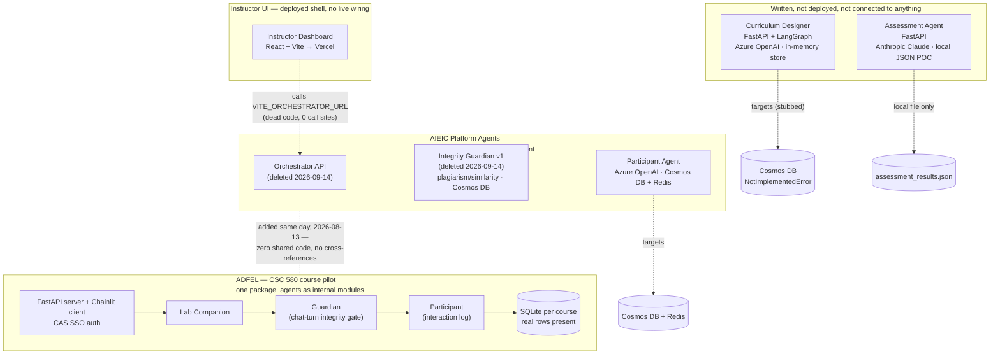
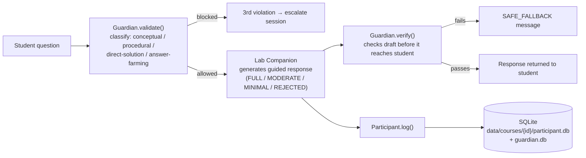

# AIEIC Implementation Audit

What's actually live, what's a local stub, and what got deleted last week — replacing the previous audit, which was out of date on most of these points.

**Repo:** CSUAIEI · **Branch audited:** `main` @ `b47d3ff` · **As of:** 2026-09-21

**Legend:** ● real data / verified · ◐ deployable, unconfirmed live · ◑ stub / POC · ○ deleted / dead code · ◈ duplicated

---

## System topology, as it exists today

The prior audit's central claim — "everything targets an Orchestrator and a Cosmos DB that don't exist" — no longer describes this repo. The Orchestrator was deleted. A second, unrelated backend was built and partly wired up with real persistence. Nothing was reconciled.

> **The single most important change since the last audit:** a new consolidated backend, `Student-UI_agentic_system-main/` (product name "ADFEL"), now does most of what the old audit described as five separate undeployed agents — and it's the only piece of the repo with verified real data (SQLite rows), named Azure infrastructure, and a real SSO flow. It has zero tests and isn't confirmed live, but it is unambiguously the most finished thing in the repo. It is **not**, however, a replacement for the AIEIC Platform Agents family (Participant Agent, the deleted Orchestrator, the deleted Integrity Guardian v1) — those were added to the repo on the exact same day and share no code with it at all. See below for why that's confusing in practice.

---

## Instructor UI

**`Instructor-Dashboard-for-AIEIC-main`** — ◐ deploy config present · ○ zero live backend calls

| | |
|---|---|
| **Deployment** | `vercel.json` present (SPA rewrite only). No way to confirm from the repo whether it's actually live. |
| **Backend calls** | `src/api/agents.ts` is a real, typed client (`fetchDashboard`, `fetchActivityTab`, `fetchIntegrityAnalytics`, `triggerGradeBatch`) targeting `VITE_ORCHESTRATOR_URL` — but has **zero call sites** anywhere else in `src/`. It's orphaned, not aspirational: the Orchestrator it targets was built, matched its routes exactly, and was deleted a week before this audit. |
| **What renders** | All six tabs — including Material Preview, previously the one tab claimed to work — now render 100% hardcoded arrays. No tab fetches anything, so none of them can fail; they just show fixed fake data every time. |
| **Auth** | `LoginPage.tsx`'s submit handler calls `onLogin()` unconditionally — no credential check of any kind. |

Correction to prior audit: it was framed as "1 of 6 tabs works, 5 fail against a missing Orchestrator." The accurate framing is "0 of 6 tabs call anything; the Orchestrator they're built for existed and was deleted, not merely never built."

---

## Curriculum Designer

**`curriculum-designer-AIEIC-main`** — ◑ in-memory only · ○ not deployed

| | |
|---|---|
| **LLM** | `AzureLLMClient` wraps `langchain_openai.AzureChatOpenAI` (`services/llm.py`); a `MockLLMClient` exists for local dev. |
| **Persistence** | `MemoryStore` (plain in-process dict) is the only working backend. `build_store("cosmos")` raises `NotImplementedError` — the README's own words: "CosmosStore lands in v0.2 — set STORAGE_BACKEND=memory for now." |
| **Deployment** | `Dockerfile` present; README states target "Azure Container Apps" — a stated intent, not a confirmed live instance. |
| **Tests** | None. `tests/` holds only an empty `__init__.py`; the README's own architecture table lists tests as "Stage D (not yet implemented)." |

Unchanged from the prior audit's description — this is the one component where that audit still holds. It also references an `INTERFACE_CONTRACT.md` that no longer exists anywhere in the repo — it lived alongside the now-deleted Orchestrator.

---

## Assessment Agent

**`assessment-agent`** — ◑ local JSON POC · ○ not deployed

| | |
|---|---|
| **LLM** | Switched to **Anthropic Claude** — `ClaudeCLIProvider` (shells to a local `claude` CLI) or `AnthropicAPIProvider` (`ANTHROPIC_API_KEY`). No Azure/OpenAI dependency anywhere in this subtree anymore. |
| **Persistence** | Local JSON files behind a file lock (`persistence.py`). The interface modules say so directly in their own docstrings: *"POC: Persists to a local JSON file. In production, this would call the [agent]'s API."* |
| **Code grading** | Not being phased out — the opposite happened. `agents/code_grader.py` now calls the LLM for partial-credit scoring per test, replacing plain exact-match (commit `011ef4a`, "Finished making sub-agent that grades assignments LLM-based"). |
| **Deployment** | None — no Dockerfile, no compose file, no Procfile in this subtree. |
| **Tests** | **45 passed / 1 failed / 4 errored.** The 4 errors are a real, fixable bug: `conftest.py` computes the repo root two `.parent`s up, landing inside `assessment_agent/` instead of `assessment-agent/`, so it can't find the demo fixtures it needs. The 1 failure is an unrelated pre-existing string-match issue in a syntax-error test. |

---

## Student-UI Agentic System — new since the last audit

**`Student-UI_agentic_system-main`** — ● real SQLite data · ◐ named Azure infra, unconfirmed live · ○ no tests

This one codebase now covers what the prior audit described as three separate, undeployed, student-facing agents. It didn't exist as a single system before.

| | |
|---|---|
| **LLM** | Dual-provider by design behind one `LLMClient` protocol — `AzureOpenAILLM` is the default, `ClaudeLLM` (`ANTHROPIC_API_KEY`) is a drop-in alternative. The only component in the repo that genuinely abstracts over both. |
| **Persistence** | SQLite per course (`agentic_system/store/sqlite.py`). **Verified real data**: `participant.db` has 2 interaction rows; `guardian.db` has populated `sessions`, `questions`, and `verifications` tables. Lives on ephemeral container storage by design — the README documents this as an accepted limitation (SQLite is incompatible with Azure Files' SMB locking), not an oversight. |
| **Auth** | Real Cal Poly CAS SSO flow (`server/auth.py`, JWT sessions), with a `CAS_MOCK=1` escape hatch for local dev. Not present anywhere else in the repo. |
| **Deployment** | The most concrete infra in the repo: two named Azure Container Apps (`adfel-server`, `adfel-client`), a named Container Registry, environment, and resource group, plus Azure AI Foundry and AI Search for RAG. Whether it's actually running cannot be confirmed from the repo alone. |
| **Tests** | Zero. `CLAUDE.md` states outright: "There is no test suite in this repo." |

---

## Two agent systems, built in parallel — not a hierarchy

This is the confusing part, so it's worth being precise about the evidence rather than just labeling things "duplicate."

> **What actually happened, as best it can be reconstructed from git history:** `Student-UI_agentic_system-main/` (product name "ADFEL"), `participant-agent-AIEIC-main/`, and the now-deleted `orchestration-agent-AIEIC-main/` and `integrity_agent-main/` were all added to this monorepo **on the same day**, 2026-08-13, each in its own separate "Add files via upload" commit — the pattern you'd expect from several pre-existing, independently-developed GitHub repos being bulk-imported at once, not one system being layered on top of another. A repo-wide search for any reference between the two sides (`agentic_system`, `adfel`, `Student-UI` mentioned anywhere outside Student-UI's own folder, or vice versa) turns up **nothing**. Student-UI's own README scopes itself to one specific class offering — *"a student-facing agentic tutoring system for Cal Poly's **CSC 580 lab course**"* — while the standalone agents carry "AIEIC" (the general platform name) in their own directory names. The most likely explanation: two people or teams, working at the same point in the project's timeline, each independently built their own version of "the student-facing agent trio" — one as a single course-specific pilot, one as general-platform microservices — without either knowing the other existed. That's an inference from the evidence below, not something stated anywhere in the repo.

### The two families, compared — ◈ incompatible by design, not by accident

| Dimension | AIEIC Platform Agents (root-level, standalone) | ADFEL / Student-UI Agentic System (course pilot) |
|---|---|---|
| Product identity | "AIEIC" — general platform | "ADFEL" — CSC 580 course pilot, specifically |
| Architecture | One FastAPI microservice per agent, meant to be called by a central Orchestrator | One monolithic package (`agentic_system/`); all three agents are internal modules in one process |
| LLM access | Raw Azure OpenAI SDK calls, per service | Pluggable `LLMClient` protocol — Azure OpenAI by default, Claude as a drop-in swap |
| Persistence | Azure Cosmos DB (+ Redis cache for Participant) | SQLite per course — **verified real rows present** |
| Auth | None observed | Real Cal Poly CAS SSO, with a mock mode for local dev |
| What "Guardian" / "Integrity" means | Cross-submission plagiarism & similarity detection, run after the fact on code/report submissions | Real-time, per-message integrity gate inside a live tutoring conversation |
| Added to repo | 2026-04-27 (Participant, first version) and 2026-08-13 (Orchestrator, Integrity Guardian v1, expanded Participant) | 2026-08-13 — the same day as the others |
| Tests | 1 file, 33 lines (Participant only); none for the deleted Integrity Guardian v1 | Zero, anywhere in the package |
| Current status | Orchestrator + Integrity Guardian v1 deleted 2026-09-14; Participant Agent still present but unconnected to anything | Still present; the most deployment-ready thing in the repo |

### How to tell which one you're looking at

- **You're in the ADFEL / Student-UI system if you see:** the folder `agentic_system/`, a `server/` + `app.py` split, Chainlit, CAS/CAS_MOCK, or "ADFEL"/"CSC 580" mentioned in a README or comment.
- **You're in the AIEIC Platform Agents family if you see:** a bare `from azure.cosmos import CosmosClient`, a standalone `main.py` FastAPI app with its own `Dockerfile` and no shared package, or "AIEIC" in the directory name or docstring.

Why this matters beyond naming: the two "Participant Agent"s and the two "Guardian/Integrity" concepts are not interchangeable and were never meant to be swapped for each other. Anyone picking up "the Participant Agent" or "the Integrity Guardian" needs to first identify which family they're holding — one plagiarism-checks finished submissions after the fact, the other integrity-checks live chat turns in progress — because treating them as the same feature with two implementations (rather than two different features that happen to share a name) is exactly the confusion this section exists to head off. The old Integrity Guardian v1 no longer exists at all, so for plagiarism/similarity detection specifically, the closest surviving code is assessment-agent's `anomaly_detector.py` — which is a third, separate implementation again, and still just a local-JSON stub that assumes an Integrity Guardian API to call that isn't there anymore.

---

## Database landscape

The prior audit's framing — "everything targets Cosmos DB, MongoDB Atlas is the proposed free fix" — no longer applies. There's no unifying decision at all, and the Mongo proposal appears to have gone nowhere: a repo-wide search for `mongo`, `pymongo`, or `atlas` returns zero hits.

| Component | LLM target | Persistence | Deployment config | Tests |
|---|---|---|---|---|
| Instructor UI | — | — | `vercel.json` | None |
| Curriculum Designer | Azure OpenAI | In-memory only | Dockerfile | None |
| Assessment Agent | Anthropic Claude | Local JSON (POC) | None | 45✓ 1✗ 4 error |
| Student-UI (Companion / Guardian / Participant) | Azure OpenAI or Claude | SQLite — real rows | Docker + named Azure infra | None |
| Participant Agent (standalone) | Azure OpenAI | Cosmos DB + Redis | Dockerfile | 1 file, 33 lines |
| Integrity Guardian v1 | — | Cosmos DB | — | deleted 2026-09-14 |

---

## Open items, in rough priority order

1. **Fix `assessment-agent/assessment_agent/tests/conftest.py`.** One extra `.parent` needed on the repo-root path; currently breaks 4 tests on `main`.
2. **Decide the Instructor UI's backend story.** Either rebuild an Orchestrator, or rewrite `src/api/agents.ts` to call Student-UI's server, the Assessment Agent, and the Curriculum Designer directly — right now it targets a service that was deliberately deleted.
3. **Reconcile the two Participant Agent implementations.** They disagree on LLM SDK, database, and deployment shape; only one has real data behind it.
4. **Pick a canonical Integrity Guardian.** The chat-turn gate (Student-UI) and submission-similarity detector (assessment-agent) are both live concerns but currently exist as unrelated code with no shared owner.
5. **Make an actual database decision.** Four components target four different persistence strategies (in-memory, local JSON, SQLite, Cosmos) with no migration path between them; the MongoDB Atlas proposal from the prior audit was never acted on.

---

*Methodology: `main` audited directly at `b47d3ff`; SQLite claims verified with direct `sqlite3` queries against the committed `.db` files; assessment-agent test counts from a live `pytest` run. This replaces the earlier "Current Implementation State Audit" artifact, most of whose central claims (Orchestrator missing-not-deleted, everything on Cosmos DB, one undeployed student-facing codebase) no longer hold.*
