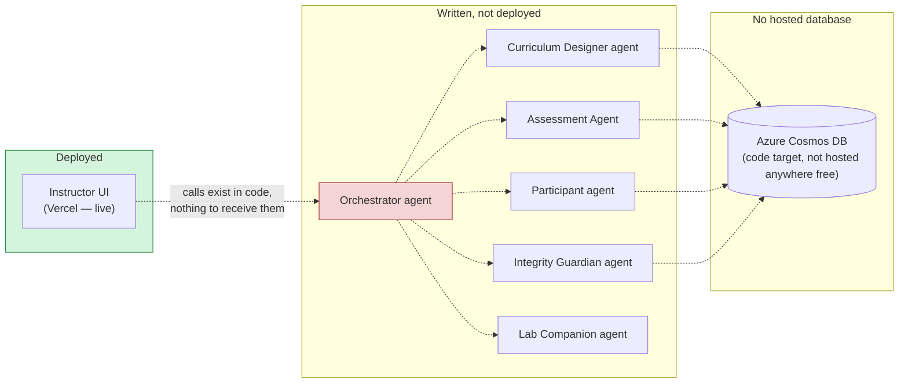
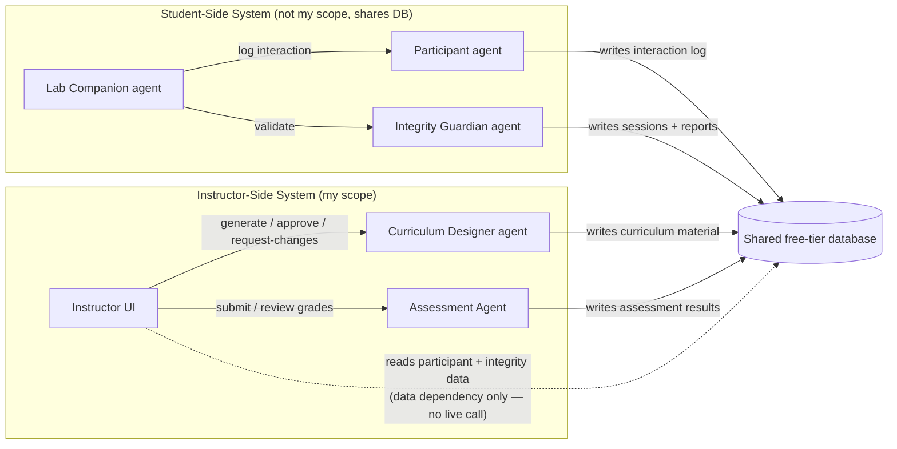
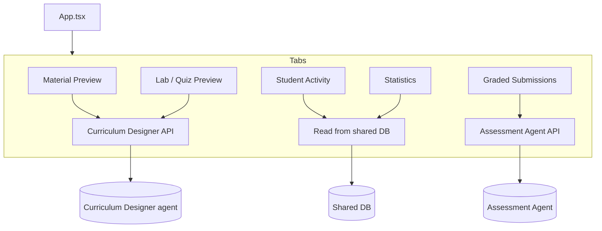
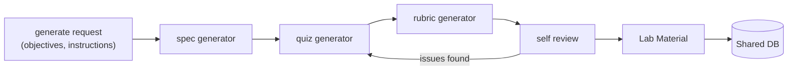
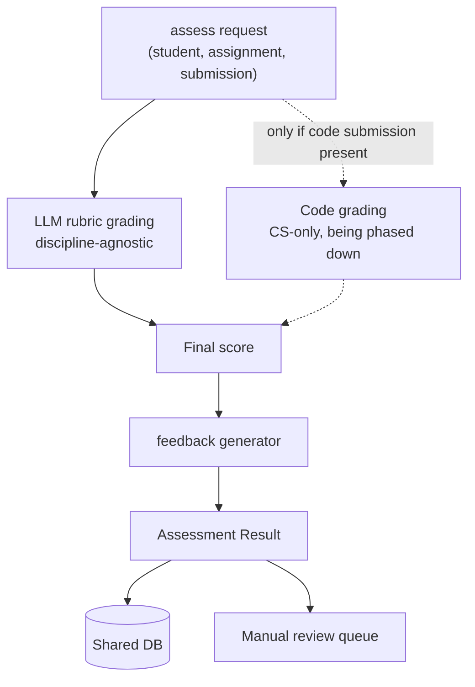
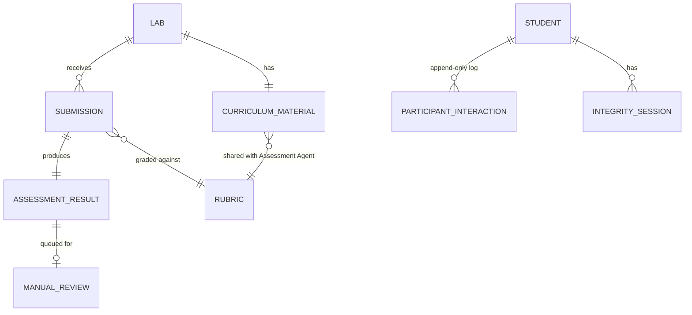

# AIEIC Instructor Workflow — Integration Plan

### Current State vs. Target State, and Free-Tier Design Decisions

Prepared by Jeron Perey — CSC 4460 Senior Project

---

## 1. Purpose

This document lays out where the AIEIC instructor workflow stands today versus where it needs to get to, and the concrete infrastructure decisions (hosting, database, AI provider) needed to build it entirely on free tiers. It's meant to be something I can hand to my advisor and teammates as a shared reference, not a final report.

**One-line summary of the current state:** only the Instructor UI is deployed (on Vercel), and it isn't wired to any backend or agent — everything downstream of the frontend exists as unconnected code.

---

## 2. Current State

### 2.1 What exists today

|Component|Status|
|---|---|
|Instructor UI|**Deployed** on Vercel. Fully built (6 tabs), but only 2 of 6 tabs call any backend function, and even those calls have nothing live to hit.|
|Curriculum Designer agent|Code exists (FastAPI + LangGraph). Not deployed anywhere.|
|Assessment Agent|Code exists (FastAPI). Grading logic is a partial rework — LLM-based rubric grading is done, CS-specific code-grading is not yet removed. Not deployed anywhere.|
|Participant agent|Code exists, written against Azure Cosmos DB. Not deployed anywhere.|
|Integrity Guardian agent|Code exists, written against Azure Cosmos DB. Not deployed anywhere.|
|Orchestrator agent|Code exists — a single hub meant to sit between the Instructor UI and everything else, and to drive the student-side flow. Not deployed anywhere.|
|Database|Nothing hosted. All agent code targets Azure Cosmos DB, which is not free-tier.|
|Second student-side implementation (ADFEL)|A separate, self-contained prototype with its own agents and its own SQLite storage — not connected to the microservices above. Status/ownership unconfirmed.|

### 2.2 Current-state diagram

Nothing below the Instructor UI is live. This diagram shows what's built vs. what's actually reachable:

_(Dashed lines = code path exists but nothing is actually running/hosted, so it does nothing today.)_

### 2.3 Known open questions before building on top of this

- **ADFEL vs. the microservice agents**: need to confirm with Oliver/Niharika which student-side implementation is the one to build against, since they don't share storage.
- **Rubric model mismatch**: Curriculum Designer and Assessment Agent each have their own, different shape for a rubric. Needs to converge into one shared entity before the database schema is finalized.
- **`AgentCollaboration` tab**: exists in the UI with no backing agent anywhere. Needs an answer from the team — build it or cut it.

---

## 3. Target State

### 3.1 Confirmed design

- Two independent systems — **student-side** (Lab Companion, Integrity Guardian, Participant agent) and **instructor-side** (Instructor UI, Curriculum Designer, Assessment Agent) — connected only through shared data, never through live calls between the two sides. This was a deliberate choice for safety isolation and so each side can be deployed/used independently.
- The Instructor UI calls Curriculum Designer and Assessment Agent directly, and reads Participant/Integrity data straight from the shared database. No orchestrator sits in the middle of the instructor path.
- My scope is the instructor-side system end to end: UI, Curriculum Designer integration, Assessment Agent integration, and the shared database.

### 3.2 Target-state diagram

### 3.3 Per-component target diagrams

**Instructor UI**

**Curriculum Designer agent**

**Assessment Agent**

**Database (target entities)**

---

## 4. Design Decisions (all free tier)

### 4.1 Frontend hosting — Vercel

Already in place, no change needed. Free tier covers a static/SPA React deployment like this comfortably.

### 4.2 Backend agent hosting — Render

Each FastAPI agent (Curriculum Designer, Assessment Agent) deploys as a free Render web service — no credit card required, no time-limited trial. The trade-off is that free services spin down after about 15 minutes of inactivity and take roughly 30–60 seconds to wake up on the next request. For a classroom demo that isn't hit constantly, that's an acceptable trade-off, and it's the only option among the mainstream platforms (Render, Railway, Fly.io) that stays free indefinitely rather than expiring after a trial period — Railway's free option is a time-limited credit, and Fly.io dropped its free tier entirely in 2024.

**Fallback**: if the cold-start delay becomes a problem during a live demo, a lightweight uptime-ping job (e.g., a scheduled request every ~10 minutes during class hours) keeps the service warm without leaving free tier.

### 4.3 Database — MongoDB Atlas (M0 free tier)

This was already the recommendation from the codebase audit and still holds: every agent's code is already written against a document/partition-key model (Cosmos DB), so Atlas's free M0 cluster is close to a client-library swap rather than a schema redesign — one collection per entity, partition-key fields become ordinary indexed fields. Atlas's free tier has no time-based pause behavior, which matters for a live classroom session where usage is bursty.

**Fallback**: Supabase (Postgres), if the team later wants real relational joins for the Statistics tab — accept a higher one-time schema-design cost and a weekly-inactivity pause in exchange.

### 4.4 AI/LLM provider — Groq (primary), Gemini (for long-context tasks)

The current code targets Azure OpenAI and the Anthropic SDK, neither of which has a real free tier at this usage pattern. Two free options fit the two different needs in this system:

- **Groq**, for most agent calls (rubric grading, feedback generation, quiz/spec generation). It's fully OpenAI-API-compatible, so swapping it in is close to a client/base-URL change rather than a rewrite, it's free with no credit card, and it's fast enough that the classroom-facing latency (a student or instructor waiting on a response) stays low.
- **Google Gemini** (via Google AI Studio), specifically for the Curriculum Designer's document-ingestion step, where instructors may upload longer source material (a syllabus, an existing lab PDF). Gemini's free tier includes a very large context window, well beyond what Groq's free models support, which matters for that specific step.

Both are genuinely free with published per-minute/per-day rate limits rather than a trial credit that expires — but rate limits on both shift over time, so this should be re-verified against each provider's current docs before locking in the final choice, not treated as permanent.

### 4.5 Summary table

|Layer|Choice|Why|
|---|---|---|
|Frontend hosting|Vercel|Already deployed, free tier is sufficient|
|Backend agent hosting|Render (free web services)|Only mainstream option with a real, non-expiring free tier|
|Database|MongoDB Atlas M0|Matches existing document/partition-key code, no pause behavior|
|AI provider|Groq (primary) + Gemini (long-context)|OpenAI-compatible swap-in, free, fast; Gemini covers large-document ingestion|

---

## 5. What changes to get from current state to target state

1. Confirm which student-side implementation (ADFEL vs. the microservice agents) is current — before wiring any Participant-agent reads.
2. Stand up MongoDB Atlas and point Curriculum Designer, Assessment Agent, Participant agent, and Integrity Guardian at it instead of Cosmos DB (mechanical client swap for the two already written against Cosmos).
3. Swap Azure OpenAI / Anthropic SDK calls for Groq (and Gemini for the document-ingestion step) in Curriculum Designer and Assessment Agent.
4. Deploy Curriculum Designer and Assessment Agent to Render.
5. Wire the Instructor UI's three unwired tabs (Student Activity, Graded Submissions, Statistics) directly to Assessment Agent / the database — bypassing the Orchestrator entirely, per the confirmed design.
6. Resolve the rubric-model mismatch between Curriculum Designer and Assessment Agent before finalizing the database schema.